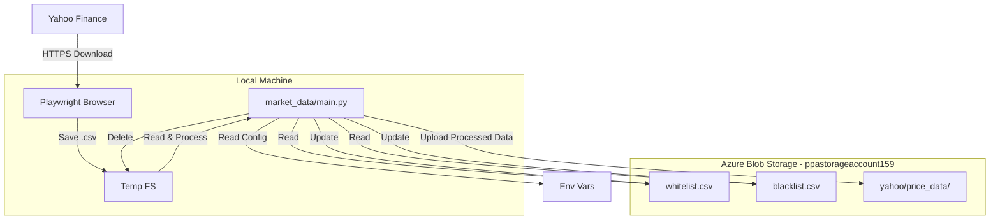

# Cloud Data Flow Architecture - Market Data
**Agent: Architect**

## Overview
This document describes the flow of market data as it moves from external sources (Yahoo Finance) through the local application (`market_data` module) and into the cloud persistent storage (**Azure Blob Storage**).

## Infrastructure Resources
- **Resource Group**: `ppa-rg`
- **Storage Account**: `ppastorageaccount159`
- **Container**: `market-data`

## Data Lifecycle

### 1. Initialization & Configuration
- **Application Start**: `main.py` initializes.
- **Config**: Loads `AZURE_STORAGE_CONNECTION_STRING` from environment variables.
- **Client**: `BlobStorageClient` establishes a connection to the `market-data` container.

### 2. Reference Data Sync
Before processing tickers, the system synchronizes reference lists.
- **Read**: `core.py` requests `whitelist.csv` and `blacklist.csv`.
- **Flow**: `Azure Blob` -> `BlobStorageClient.read_csv()` -> `DataFrame` (Memory).
- **Note**: These files are **not** persisted to the local disk; they exist only in memory as Pandas DataFrames.

### 3. Ticker Discovery
- **Logic**: `get_symbols()` fetches the universe of active tickers.
- **Filtering**: Applies the in-memory Blacklist/Whitelist to filter the universe.

### 4. Data Ingestion (Per Ticker)
This process repeats for each symbol involved in the refresh.

#### A. Freshness Check
- **Check**: `core.py` checks `yahoo/price_data/{ticker}.csv` in Azure.
- **Flow**: `BlobStorageClient.get_last_modified()` -> Compare with `DATA_FRESHNESS_THRESHOLD`.
- **Decision**:
    - If **Fresh**: Download skipped. Use existing data (if needed for downstream analysis).
    - If **Stale/Missing**: Proceed to Download.

#### B. Acquisition (Local Execution)
- **Tool**: Playwright (Headless Browser) running locally.
- **Action**: Navigates to Yahoo Finance, initiates download.
- **Temp Storage**: Saves file to local `%TEMP%` or `Downloads/temp` directory.
    - *Why Local?* Playwright requires a filesystem path to save downloaded streams efficiently.

#### C. Processing & Validation
- **Read**: `core.py` reads the temp CSV into a DataFrame.
- **Clean**: Removes `Adj Close`, formats dates, sorts by date, rounds values.
- **Validate**: Checks against schema requirements.

#### D. Cloud Persistence
- **Write**: The processed DataFrame is uploaded to Azure.
- **Flow**: `DataFrame` -> `BlobStorageClient.write_csv()` -> `Azure Blob (yahoo/price_data/{ticker}.csv)`.
- **Cleanup**: The local temp file is deleted immediately after successful upload.

### 5. State Updates
- **Auto-Whitelist**: If a download is successful, the ticker is added to the Whitelist.
- **Blacklist**: If a ticker fails (404/No Data), it is added to the Blacklist.
- **Flow**: `DataFrame` (Updated) -> `BlobStorageClient.write_csv()` -> `Azure Blob`.

## Diagram

