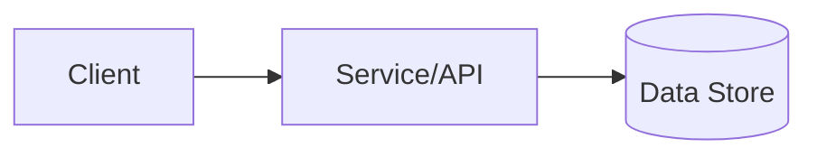

# Concept: <Topic>

## Summary

<One paragraph that explains the idea and why it matters.>

## Problem it solves

- <What pain does this address?>

## Mental model

<Explain how to think about it. Prefer an analogy or a simple model.>

## Key terms

| Term | Meaning |
|------|---------|
| <term> | <definition> |

## Architecture (optional)

## How it works (step-by-step)

1. <Step 1>
2. <Step 2>
3. <Step 3>

## Tradeoffs / design choices

- <Tradeoff>
- <Tradeoff>

## Related docs

- <Link to how-to>
- <Link to API reference>

## Evidence

- Code: `path/to/file.ext:line`
- Tests: `path/to/test.ext:line`
- Spec/schema: `path/to/spec.ext:line` (or URL if applicable)
